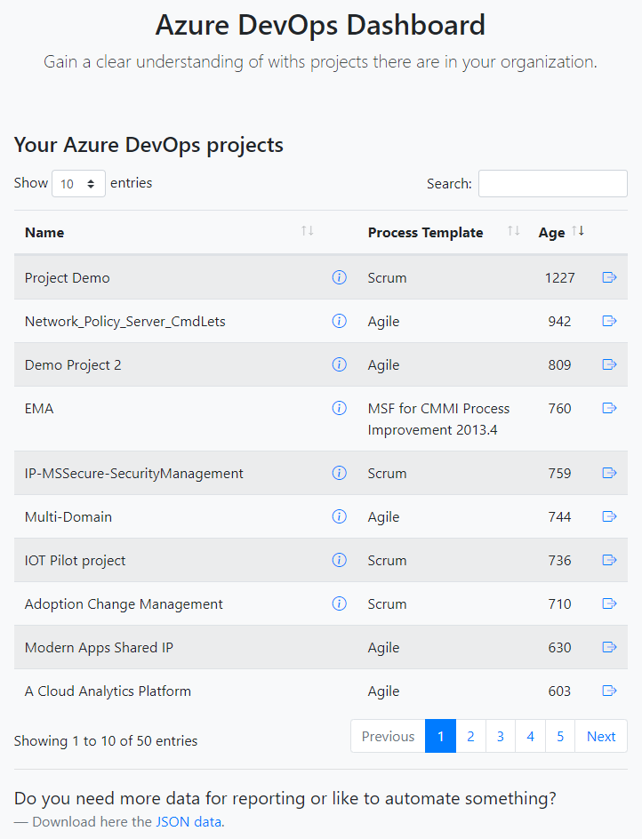

# Azure DevOps Dashboard

This dashboard solution generates a simple overview of all the [Azure DevOps](https://dev.azure.com/) projects in your organization and calculates the last known activity in days on commits, work items, and the project itself. You can connect this dashboard (using the included endpoint) to [Microsoft Power Automate](https://flow.microsoft.com/) to automate task on project level.



## The architecture

The solution runs on as a single [Azure Web App](https://azure.microsoft.com/en-us/services/app-service/web/) (Windows or Linux), it uses a background [WebJob](https://docs.microsoft.com/en-us/azure/app-service/webjobs-create) to collect all the data needed to present in the web dashboard. If you have many DevOps projects (more than 300) in a single Azure DevOps organization, it is recommended to move them to a multiple organization set up to avoid any performance issues with Azure DevOps.

The WebJob uses an Azure DevOps personal access token (PAT) to communicate. See here [how to get a personal access token](https://docs.microsoft.com/en-us/azure/devops/organizations/accounts/use-personal-access-tokens-to-authenticate?view=azure-devops&tabs=preview-page).


You can also run the WebJob locally, set the following two environment variable first `azDevOpsUri` and `azDevOpsPat` that corresponds with your Azure DevOps organization account:

```cmd
SET azDevOpsPat=tjqp44k54nqfmppaqd7di27kpvh...........
SET azDevOpsUri=https://dev.azure.com/yourorgname.....
```

## Installation


## API

```json
[
    {
        "projectId": "guid",
        "name": "project name",
        "description": "project description",
        "url": "https://dev.azure.com/projectname",
        "owners": [
            {
                "displayName": "Contoso Admin name",
                "mailAddress": "admin@contoso.com"
            }
        ],
        "processTemplate": "Scrum",
        "lastProjectUpdateTime": "2021-03-22T11:40:32.09Z",
        "lastCommitDate": "2020-04-23T18:00:27Z",
        "lastWorkItemDate": "0001-01-01T00:00:00",
        "lastKnownActivity": "2021-03-22T11:40:32.09Z",
        "projectAge": 83.92575148777316
    }
]
```
