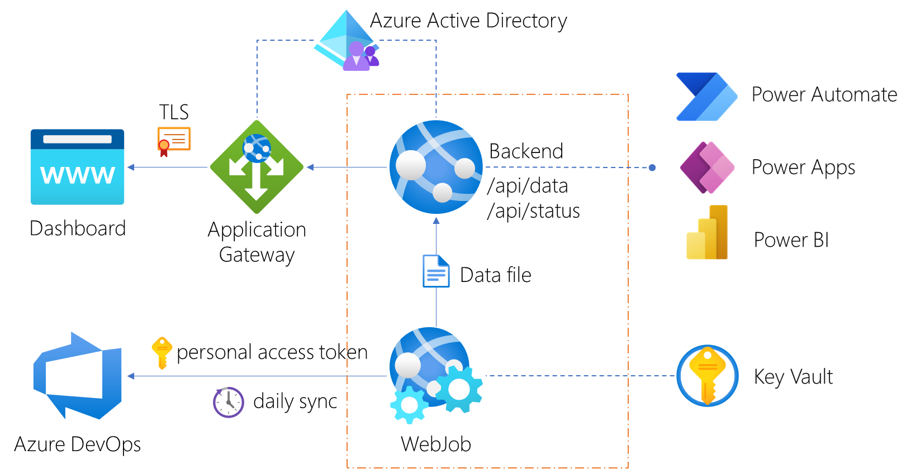

# Introduction

When you are managing Azure DevOps in a large enterprise organization, and you are still using only one Azure DevOps organization account, you are probably hitting some limits or have potential performance issues. Microsoft's recommendation is to have around 300 projects in a single Azure DevOps organization account. I have seen Azure DevOps organizations with more than 600 projects that still work.

The solution is to set up a multi-organization structure. Move all the inactive projects to an archive or boneyard Azure DevOps organization account and add an extra Azure DevOps organization account per department.

Next, you need some insights and automation on which projects have no activity anymore. The Azure DevOps Dashboard gives you the basic insights and an API to automate tasks like emailing the owners of inactive projects.

# Azure DevOps Dashboard

This dashboard solution generates a simple overview of all the [Azure DevOps](https://dev.azure.com/) projects in your organization and calculates the last known activity in **days** on commits, work items, and the project itself. You can connect this dashboard (using the included endpoint) to [Microsoft Power Automate](https://flow.microsoft.com/) or Excel to automate tasks on project level.


## Installation

The solution runs on as a single [Azure Web App](https://azure.microsoft.com/en-us/services/app-service/web/), it uses a background [WebJob](https://docs.microsoft.com/en-us/azure/app-service/webjobs-create) to collect all the data needed to present in the web dashboard.

### Prerequisites 

1. An Azure account with an active subscription. [Create an account for free](https://azure.microsoft.com/free/dotnet).
2. Install the [Azure CLI on Windows](https://docs.microsoft.com/en-us/cli/azure/install-azure-cli-windows) to automate the following steps
3. An Azure DevOps personal access token (PAT). See here [how to get a personal access token](https://docs.microsoft.com/en-us/azure/devops/organizations/accounts/use-personal-access-tokens-to-authenticate?view=azure-devops&tabs=preview-page).
4. Download the Azure DevOps Dashboard [Release.zip](https://github.com/cschotte/Azure-DevOps-Dashboard/raw/main/Release.zip) package.

### Create an Azure Web App

In the next steps, you will create a resource group, an app service plan (the webserver), and the Web App (the solution itself). We also add two application settings to store the Azure DevOps personal access token.

1. Login into your Azure subscription

```cmd
az login
```

2. (Optional) Select the subscription where you like to deploy the dashboard.

```cmd
az account set --subscription "<your subscription>"
```

3. Create a resource group, change the name `rg-azdevops`

```cmd
az group create -l westeurope -n rg-azdevops
```

4. Create an app service plan and webapp, change the names `plan-azdevops` and `azdevops`

```cmd
az appservice plan create -g rg-azdevops -n plan-azdevops -l westeurope

az webapp create -g rg-azdevops -p plan-azdevops -n azdevops -r "DOTNET|6.0"
```

5. Add your Azure DevOps URL and personal access token (PAT)

```cmd
az webapp config appsettings set -g rg-azdevops -n azdevops --settings azDevOpsPat=<your token>
az webapp config appsettings set -g rg-azdevops -n azdevops --settings azDevOpsUri=https://dev.azure.com/<yourorgname>
```

6. Set the `always-on` future we need for the WebJob

```cmd
az webapp config set -g rg-azdevops -n azdevops --always-on true
```

### Deploy the Azure DevOps Dashboard

Did you download the Azure DevOps Dashboard [Release.zip](https://github.com/cschotte/Azure-DevOps-Dashboard/raw/main/Release.zip) package? After the installation we also run the WebJob for the first time, this can take a while depending on how many projects you have in your Azure DevOps organization account.

> **Authentication** In the release package authentication is disabled! Please register your application first in your Azure Active Directory by following the steps described [here](https://docs.microsoft.com/en-us/azure/active-directory/develop/quickstart-v2-aspnet-core-webapp). You only need to update the **appsettings.json** inside the release package.

```cmd
az webapp deployment source config-zip -g rg-azdevops -n azdevops --src Release.zip

az webapp webjob triggered run -n azdevops -g rg-azdevops --webjob-name Webjob
```

## Architecture



You can also run the WebJob locally, set the following two environment variable first `azDevOpsUri`
and `azDevOpsPat` that corresponds with your Azure DevOps organization account:

```cmd
SET azDevOpsPat=<your token>
SET azDevOpsUri=https://dev.azure.com/<yourorgname>
```

## Using the API

To automate tasks, you can use the API to connect to Excel, Microsoft Power Automate, or whatever you need. The `/api/data` API will return a list of the following project properties:

```json
[
    {
        "projectId": "guid",
        "name": "project name",
        "description": "project description",
        "url": "https://dev.azure.com/projectname",
        "owners": [
            {
                "displayName": "Contoso Admin name",
                "mailAddress": "admin@contoso.com"
            }
        ],
        "processTemplate": "Scrum",
        "lastProjectUpdateTime": "2021-03-22T11:40:32.09Z",
        "lastCommitDate": "2020-04-23T18:00:27Z",
        "lastWorkItemDate": "0001-01-01T00:00:00",
        "lastKnownActivity": "2021-03-22T11:40:32.09Z",
        "projectAge": 83.92575148777316
    }
]
```

## Migration Tools for Azure DevOps

Out of the box Azure DevOps will not migrate projects between organizations (this future is requested for [many years](https://developercommunity.visualstudio.com/t/make-it-possible-to-move-a-team-project-between-te-1/365365), but on technical level it is not going to happen). Luckily, there are tools available to help you to migrate/move projects:

* [Move Git repositories to another project with full-fidelity history](https://docs.microsoft.com/en-us/azure/devops/repos/git/move-git-repos-between-team-projects).
* [VSTS work item migrator](https://github.com/microsoft/vsts-work-item-migrator)
* [Migration Tools for Azure DevOps](https://marketplace.visualstudio.com/items?itemName=nkdagility.vsts-sync-migration)
* 3rd party tool: [OpsHub Visual Studio Migration Utility](https://www.opshub.com/products/opshub-visual-studio-migration-utility/)

## License

*Code License: [MIT](LICENSE)* Applies to all files.
